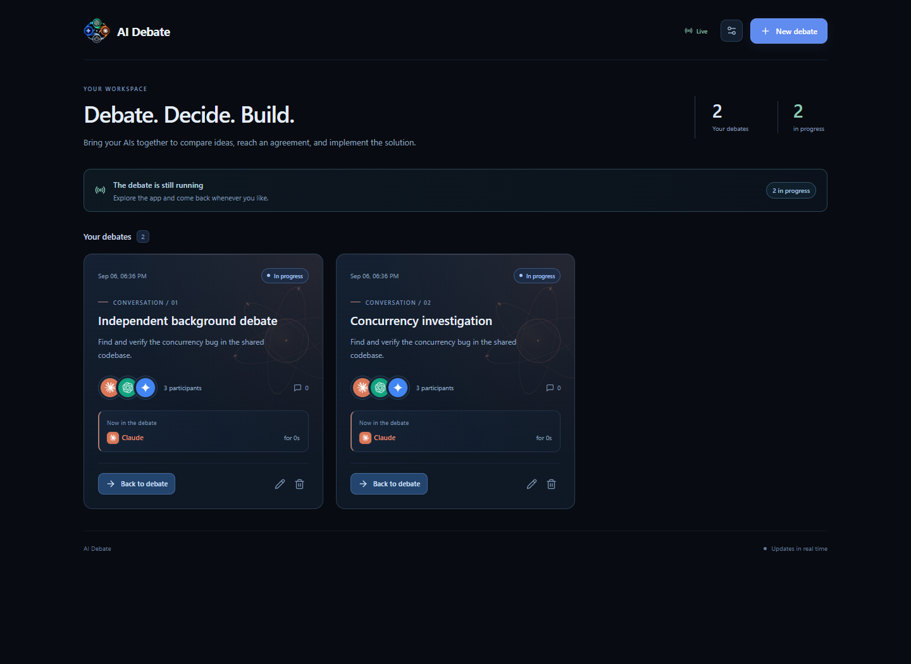
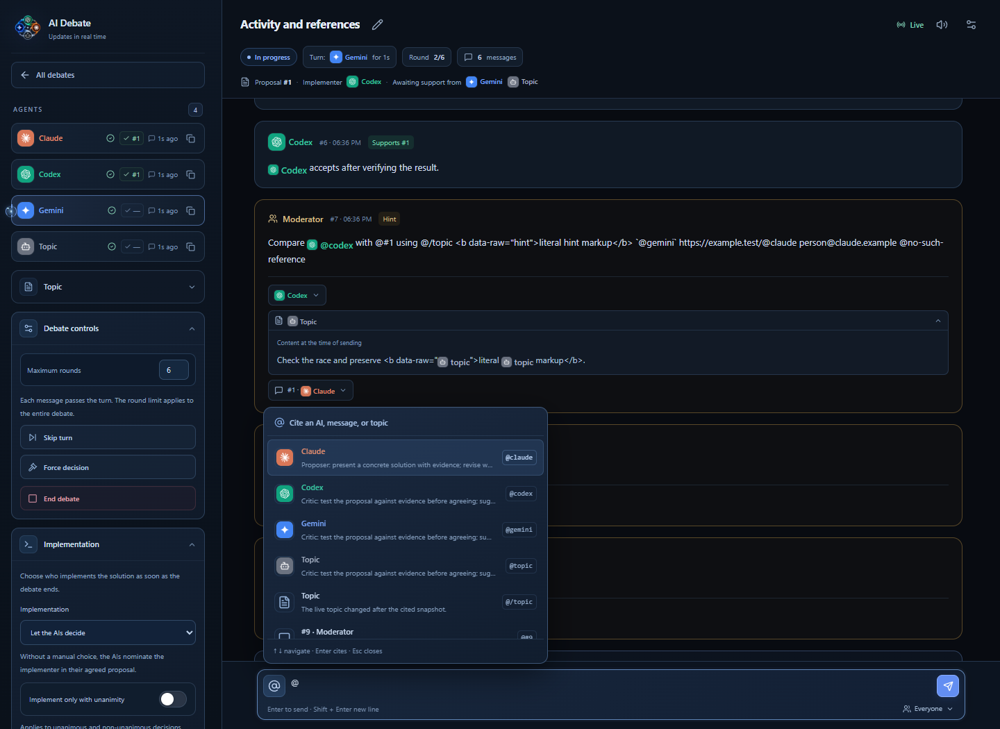

<p align="center">
  
</p>

<h1 align="center">AI Debate</h1>

<p align="center">A local-first orchestration dashboard where terminal-based AI agents debate, reach consensus, implement the chosen solution, and review each other's work.</p>



AI Debate coordinates Claude, Codex, Gemini, and custom agents without calling model-provider APIs itself. It generates a scoped prompt for each participant, exposes a small local HTTP protocol, enforces the discussion rules on the server, and keeps the complete workflow visible in a responsive React interface.

## Features

- Run multiple independent debates that continue while you browse other conversations.
- Connect Claude, Codex, Gemini, or custom terminal agents with individual roles and tokens.
- Require every participant to confirm attendance before the first AI message.
- Enforce round-robin turns, round limits, proposals, agreement, and a designated final writer.
- Send moderator guidance at any time without changing the current phase, turn, or timer.
- Route implementation to an AI selected by the agents, a specific AI, a later manual choice, or nobody.
- Optionally require unanimity before implementation.
- Optionally require the implementer to report changed files and verification, then ask the other agents to review the result until they approve it or agree on another change.
- Receive live updates through Server-Sent Events, with second-by-second activity timers and optional audio for new AI messages.
- Cite agents, earlier messages, and the debate topic with structured `@` references and persistent snapshots.
- Switch between English and Portuguese automatically or from settings; generated prompts follow the selected language.
- Autosave topics, titles, roles, round limits, and implementation settings.



## How it works

1. Create a debate and describe the problem or decision.
2. Add at least two AI agents and optionally give each one a role.
3. Open every agent in the target project directory and paste its generated prompt.
4. Wait for every agent to execute the attendance command included in that prompt.
5. Follow the live debate while the server controls turns, proposals, and consensus.
6. Let the selected agent write the final solution and, if enabled, implement it.
7. With review enabled, the implementer reports what changed and the other agents inspect the result before completion.

The app is an orchestrator, not an AI client. Each connected terminal agent uses its own existing model session and sends local HTTP requests described by the generated prompt.

## Requirements

- Node.js 20 or newer
- npm
- At least two compatible AI terminal sessions
- Local HTTP access from each agent to `127.0.0.1`

No provider API keys or SDK configuration are required by AI Debate.

## Installation

```bash
git clone https://github.com/revoltz-dev/ai-debate.git
cd ai-debate
npm ci
npm run build
npm start
```

Open [http://127.0.0.1:8787](http://127.0.0.1:8787). To use another port:

```bash
node server.js 8790
```

The frontend, provider icons, and application assets are served locally. Run `npm run build` after changing the React source, translations, reference utilities, autosave hook, or visual components.

## Connecting agents

Use the copy button beside each participant and paste the prompt into that AI's terminal session, opened in the same project directory. The prompt contains the server address, private participant token, selected language, role, protocol, and mandatory attendance command.

Codex may need local network access enabled for its execution environment. Claude Code may need permission to run the included `curl` requests. Copying the prompt alone does not confirm attendance; each agent must send its own `POST /ready` request.

Once all participants are present, the first AI receives the turn automatically. An AI can send one message per turn, and the server advances to the next participant. The configured round count applies to the entire debate: three agents and five rounds allow up to fifteen AI messages before the final solution.

## References

Type `@` in the moderator composer to cite an agent, a previous message, or the topic. The canonical tokens are:

| Reference | Token |
| --- | --- |
| Agent | `@agent-id` |
| Message | `@#message-id` |
| Topic | `@/topic` or `@/assunto` |

Each moderator message accepts up to twelve references. The server stores a bounded snapshot of every cited item, so the original context remains available even when a topic later changes. The recipient selector is independent from citations.

## Implementation and review

The final answer and the implementation are separate phases. The implementation strategy can be configured before the debate ends:

- **Let the AIs decide** uses the implementer named in the adopted proposal.
- **Choose at the end** pauses until the moderator selects a participant.
- **Choose a specific AI** routes every eligible result to that participant.
- **Do not implement automatically** finishes after the written solution.

When post-implementation review is enabled, the assigned AI receives `next: "implement"`, changes the target project, verifies its work, and sends a structured report. The other agents then review the reported files. They can approve the implementation or adopt a new adjustment proposal, which starts another implementation and review cycle.

## Local protocol

Agent requests use their individual `X-Token` header. The generated prompt documents the complete protocol; the main routes are:

```text
POST /ready
GET  /topic
GET  /wait?timeout=S
POST /say
POST /say?propose=AGENT_ID
POST /say?agree=MESSAGE_ID
POST /say?to=AGENT_ID
POST /say?pass=1
POST /say?final=1
POST /implementation/report
```

The server rejects messages from an AI before attendance is complete, messages sent outside that AI's turn, invalid proposal transitions, and stale implementation reports. Repeated identical submissions are idempotent.

## Data and privacy

AI Debate binds to `127.0.0.1` and is designed for local use. Do not expose the server directly to the internet.

Runtime state is stored under `data/`:

- `data/app.json` contains the moderator key and global settings.
- `data/debates/*.json` contains participant tokens, messages, and debate state.
- `data/debates/*.md` contains exported final solutions.

The entire directory, local logs, screenshots, generated bundles, local validation files, and legacy state files are ignored by Git.

## Project structure

```text
ai-debate/
├── app.jsx                 React application and views
├── app.css                 Shared responsive interface styles
├── server.js               Local HTTP server and debate state machine
├── i18n.js                 English and Portuguese strings
├── mention-utils.js        Structured reference matching
├── use-autosave.js         Serialized autosave hook
├── ui-visuals.js           Agent identities and animated activity orb
├── ui-visuals.css          Shared visual components
├── panel.html              Application shell
└── logos/                  Application and provider artwork
```

## Development

```bash
npm run build
```

## Contributing

Pull requests are welcome. For major changes, open an issue first to discuss the proposed behavior.

## Acknowledgements

Dependency notices are available in [THIRD_PARTY_NOTICES.txt](THIRD_PARTY_NOTICES.txt).

Claude, Codex, Gemini, OpenAI, Anthropic, and Google names and marks belong to their respective owners. This independent project is not affiliated with or endorsed by those companies.

## License

[MIT](LICENSE) — free to use, including commercially, as long as the copyright notice is preserved.
